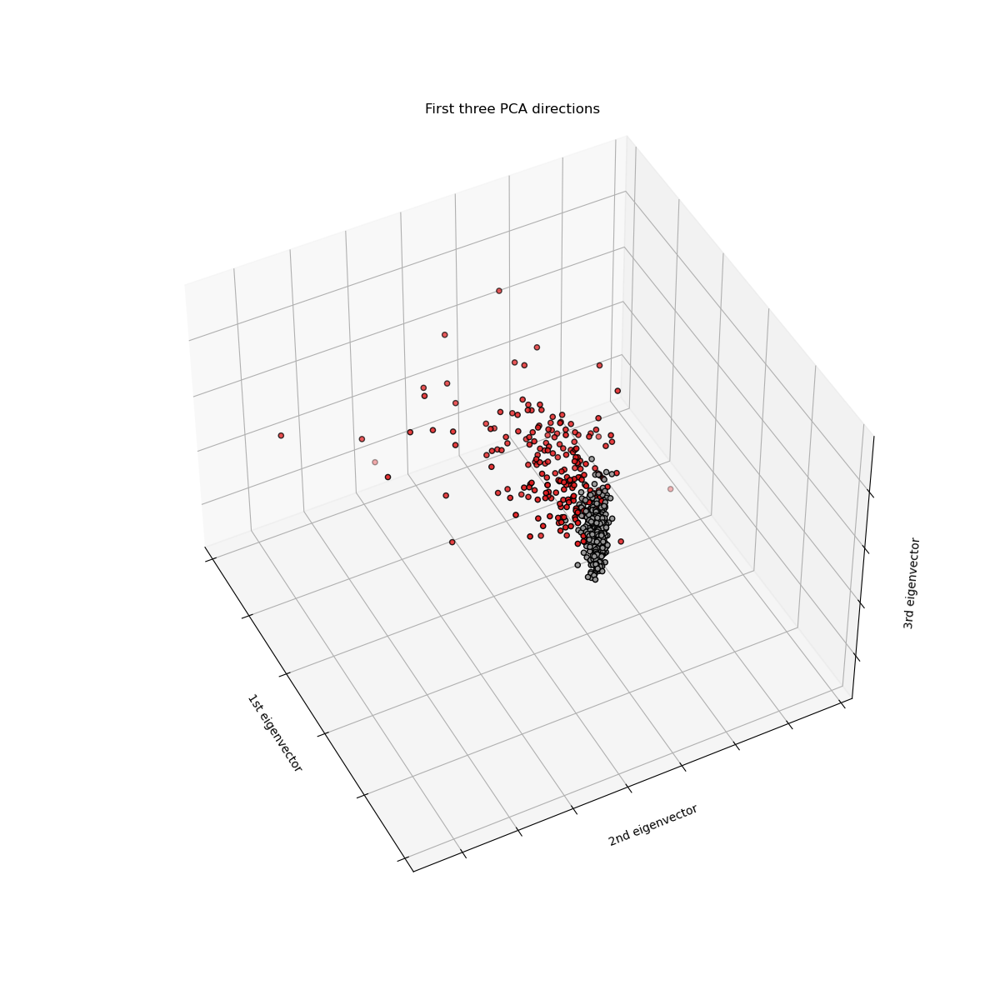

## Breast Cancer Classification with Naïve Bayes Classifier 
 
[**💾 DATASET**](https://archive.ics.uci.edu/ml/datasets/Breast+Cancer+Wisconsin+%28Diagnostic%29) **|** [**💻 Jupyter Notebook**](https://jupyter.org/install) **|** [**🔥 PyTorch**](https://pytorch.org/get-started/locally/) **|**  [**🔗 LinkedIn**](https://www.linkedin.com/in/marcellbalogh) 👈🏽
#### 🔍 Description
<p align="justify">This is a native implementation of Naïve Bayes Classifier from scratch in Python.</p>

<p align="center">
  
</p>

---
#### ☑️ Prerequisites
- Python3
- See [requirements.txt](requirements.txt) for required packages
- Windows, Linux, MacOS

###### ⚙️ Installation
```html
   git clone https://github.com/BaMarcy/NBC.git
```
```html
   pip install -r requirements.txt
```
---
#### ⚙️ Run
```html
   jupyter notebook train.ipynb
```
